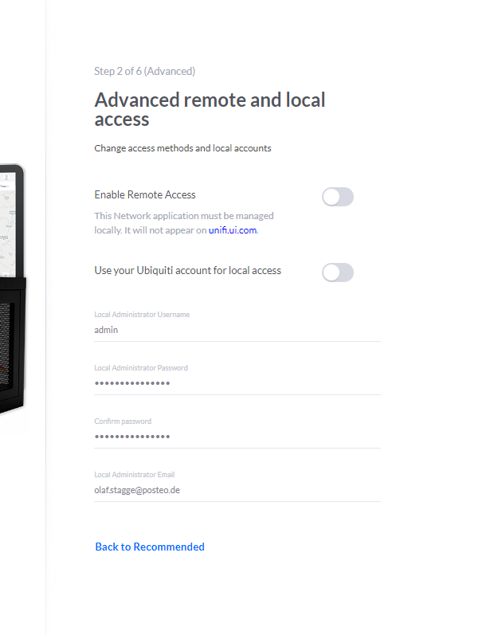

# Unifi Controller
Der UniFi-Controller ist das Herzstück des UniFi Netzwerkes. Die Geräte laufen zwar ohne den Controller, allerdings können keine Einstellungen lokal an den Geräten vorgenommen werden.

https://hub.docker.com/r/jacobalberty/unifi

## Weitere Tutorials
### Blog
- [So gelingt dir dein Unifi Controller Update garantiert!](https://www.teqqy.de/unifi-controller-update-wie-geht-es-richtig/)
- [UniFi Map erstellen und nutzen](https://www.teqqy.de/unifi-map-erstellen-und-nutzen/)
- [Unifi L2TP (IPSec) VPN mit Radius und Fritzbox](https://www.teqqy.de/unifi-l2tp-ipsec-vpn-mit-radius-und-fritzbox/)

### YouTube
- [Unifi Controller Einstellungen - Was bedeutet was?](https://www.youtube.com/watch?v=4S_NccuxmOo)
- [Unifi USG Firewall Regeln kurz erklärt - Tuturial deutsch](https://www.youtube.com/watch?v=MStjcCKyMQo)
- [Tutorial: Unifi WLAN mittels Synology Radius Server absichern](https://www.youtube.com/watch?v=awySc8peKzs)
- [Unifi WLAN optimieren und allgemeine WLAN Tipps](https://www.youtube.com/watch?v=s9YCEZKoBxI)

## Initial Setup



Wifi Name: UNIFI-AP-PRO-BS
System: 24h, Dark, Network Device SSH --> Password, SSH Key hinzufügen, Legacy Interface

## Adopting Device

```bash
ssh admin@192.168.178.4  #admin |19I...   oder ubnt|ubnt
help
info
set-default
syswrapper.sh restore-default
mca-cli
set-inform http://192.168.178.20:8080/inform     mehrfach ausführen
```
https://community.ui.com/questions/AP-disconnected-after-adoption/d113094b-256f-4e1a-afa6-7025196c80d9


## Einstellungen
- Site: [x] Enable advanced features
- Drahtlos-Netzwerke: disable Fast Roaming (derzeit BETA), disable ausschließlich 5GHz
- Networks: DHCP Mode none